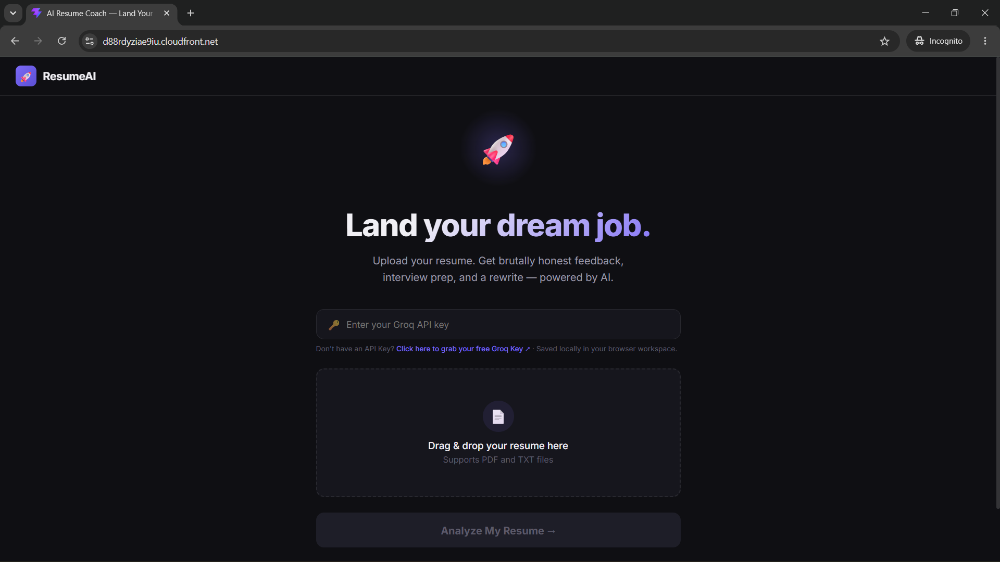

<div align="center">


<br><br>


<br>

**[🚀 Live Demo](https://d88rdyziae9iu.cloudfront.net/)** &nbsp;•&nbsp;
[Features](#-key-features) &nbsp;•&nbsp; [Architecture](#️-system-architecture) &nbsp;•&nbsp; [Tech Stack](#️-tech-stack--tools) &nbsp;•&nbsp; [API](#-api-endpoints-core-backend) &nbsp;•&nbsp; [Setup](#-getting-started)

</div>

---

## 📸 Demo

<div align="center">



**[🚀 Try it live →](https://d88rdyziae9iu.cloudfront.net/)**

</div>

---

## 🌟 Key Features

| | |
|---|---|
| 📄 **Semantic resume parsing** | Extracts structured details from unstructured PDF/Word resumes using advanced NLP techniques |
| 🎯 **Contextual JD matching** | Goes beyond keyword matching — analyzes actual depth of experience and skills against a specific job description |
| 🤖 **AI-driven scoring & feedback** | Uses Llama models to generate a compatibility score and actionable feedback |
| ⚡ **Ultra-fast inference** | Groq API integration for lightning-fast text processing and analysis generation |
| 🔌 **Developer-friendly API** | Clean, modular Flask backend, ready for integration with frontend dashboards |

---

## 🏗️ System Architecture

```
[User Interface / Postman]
       │
       ▼ (Multipart Form Data: Resume + JD)
[Flask Backend API]
       │
       ├─► [NLP Text Extraction Pipeline] ──► Cleaned Text
       │
       ▼ (Structured Prompt Construction)
[Groq API Gateway] ──► [Llama Inference Engine]
       │
       ▼ (JSON Response Generation)
[Score & Feedback Delivery Engine]
```

---

## 🛠️ Tech Stack & Tools

<div align="center">


</div>

| Layer | Tech |
|---|---|
| Backend Framework | Python, Flask |
| AI & Inference | Groq API (Llama Models) |
| Text Processing | NLP techniques, PyPDF2 / pdfplumber |
| Environment & Tools | VS Code, Git, Postman |
| Deployment | AWS (EC2 / Elastic Beanstalk) |

---

## 🚀 Getting Started

<details>
<summary><b>🔽 Prerequisites</b></summary>
<br>

- Python 3.8+
- A Groq API key — get one from the [Groq Console](https://console.groq.com/)

</details>

<details>
<summary><b>🔽 Installation & Setup</b></summary>
<br>

**1. Clone the repository**
```bash
git clone https://github.com/yourusername/ai-resume-checker.git
cd ai-resume-checker
```

**2. Create and activate a virtual environment**
```bash
python -m venv venv
# On Windows:
venv\Scripts\activate
# On macOS/Linux:
source venv/bin/activate
```

**3. Install the dependencies**
```bash
pip install -r requirements.txt
```

**4. Configure environment variables**

Create a `.env` file in the root directory:
```env
FLASK_APP=app.py
FLASK_ENV=development
GROQ_API_KEY=your_groq_api_key_here
```

**5. Run the application**
```bash
flask run
```

The backend API will be live at `http://127.0.0.1:5000/`.

</details>

---

## 🔌 API Endpoints (Core Backend)

### `POST /api/score-resume`

Processes a resume against a provided job description.

- **Content-Type:** `multipart/form-data`
- **Request Body:**
  - `resume`: (File) `.pdf` or `.docx` format
  - `job_description`: (Text) the text of the target role requirement

<details>
<summary><b>🔽 Example Response</b></summary>
<br>

```json
{
  "status": "success",
  "data": {
    "match_score": "84%",
    "key_alignments": ["Proficient in Python backend development", "Strong understanding of NLP architecture"],
    "skill_gaps": ["Missing explicit Docker/Containerization experience"],
    "verdict": "Highly Recommended for Interview Stage"
  }
}
```

</details>

---

## 📐 Engineering Highlights & Optimizations

- **Sub-second AI inference** — swapped standard LLM APIs for the Groq API engine, slashing token generation latency for near-instant evaluation
- **Prompt engineering** — deterministic JSON-structured prompt template enforces consistent parsing and eliminates LLM hallucination in scoring
- **Text normalization** — regex-based NLP pipelines strip noise, headers, and invalid encodings from PDF streams before tokenization, cutting token costs by ~25%

---

## 🗺 Future Roadmap

- [ ] Build a responsive frontend dashboard using HTML5/Tailwind CSS
- [ ] Implement batch resume processing with an asynchronous task queue (Celery/Redis)
- [ ] Containerize the full stack using Docker for seamless multi-environment deployment
- [x] Deploy live via AWS infrastructure

---

<div align="center">

## 👤 Developed by

**[Ayush Gupta](https://github.com/ayushxdev01)**

[](https://github.com/ayushxdev01)

---
<sub>Built with ❤️ using Python, Flask & Groq</sub>

</div>
